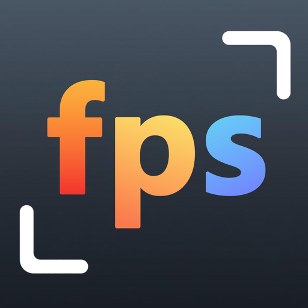

# Free‑FPS [![GitHub release][release-img]][release-url]  [![license][license-url]](LICENSE)

Open‑source desktop app and scripts to change a video file frame rate \(FPS\) <ins>**using FFmpeg**</ins>.  
It does not add effects or alter content; it adjusts playback speed and, if needed, re‑encodes audio.  
Originals are never modified.

Download [latest release](https://github.com/undelalune/free-fps/releases/latest/) for Windows / macOS
  

## What it does

- Changes video FPS via FFmpeg.
- Keeps or re‑encodes audio if requested.
- No effects, no content edits.
- Writes results to a separate output folder by default.

## Requirements
> FFmpeg and FFprobe are required!
- Uses versions found in system `PATH`, or set explicit paths in app settings, i.e. you don't have to install it.
- Get FFmpeg: [FFmpeg downloads](https://ffmpeg.org/download.html) (or see localized App's guides below).

## Quick links

- App user guide:
  [Беларуская](app/src/md/by.MD), [Deutsch](app/src/md/de.MD), [English](app/src/md/en.MD), [Español](app/src/md/es.MD),
  [Français](app/src/md/fr.MD), [Italiano](app/src/md/it.MD), [Polski](app/src/md/pl.MD), [Português](app/src/md/pt.MD),
  [Русский](app/src/md/ru.MD), [Українська](app/src/md/ua.MD)

- You can also run the scripts directly with PowerShell or bash/sh if you don't want to use the desktop app.  
  Scripts user guide: [Windows](scripts/win/README.md), [MacOS](scripts/unix/README.md).

## Desktop app

- Platforms
    - Windows 10 1809\+ and Windows 11. Requires Microsoft Edge WebView2 runtime. Older Windows versions are not supported and the app may not start.
    - macOS 10.15\+ on Intel and Apple Silicon. Older macOS versions are not supported and the app may not start.
- UI tech is web‑based. Internet Explorer is not supported. Docs/UI render correctly in modern Edge, Firefox, Chrome, and Safari \(latest two versions\).

## Scripts

- Windows PowerShell and macOS shell scripts perform the same conversion with fewer controls.
- FFmpeg and FFprobe must be available (in `PATH` or standalone). See per‑platform guides above.

## Support the project

&nbsp;&nbsp;

## Tech stack
[![tauri-img]][tauri-url] [![vue-img]][vue-url] [![vite-img]][vite-url]
- Tauri 2 \(Rust\)
- Vue 3, TypeScript, Naive UI, Vite
- GitHub Actions for builds and releases

## For developers
### Build from source

- Prerequisites: Node.js LTS, Rust/Cargo, and Tauri prerequisites for your platform.
- Commands:
    - Install: `npm i`
    - Dev: `npm run tauri:dev`
    - Build: `npm run tauri:build`

[release-img]:     https://img.shields.io/github/v/release/undelalune/free-fps
[release-url]:     https://github.com/undelalune/free-fps/releases/latest/
[license-url]:     https://img.shields.io/github/license/dec0dOS/amazing-github-template.svg?style=flat-rounded
[tauri-img]:       https://img.shields.io/badge/Tauri-FFC131?style=for-the-badge&logo=Tauri&logoColor=white
[tauri-url]:       https://tauri.app/
[vue-img]:         https://img.shields.io/badge/Vue%20js-35495E?style=for-the-badge&logo=vuedotjs&logoColor=4FC08D
[vue-url]:         https://vuejs.org/
[vite-img]:        https://img.shields.io/badge/Vite-B73BFE?style=for-the-badge&logo=vite&logoColor=FFD62E
[vite-url]:        https://vite.dev/
