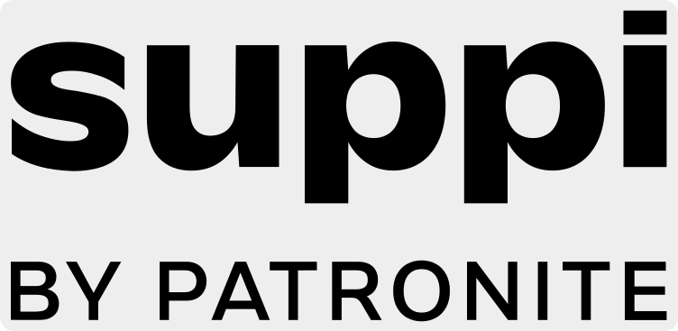

- [Про цю програму](#about-this-tool)
- [Головна сторінка](#main-page)
- [Сторінка конвертації](#processing-page)
- [Ліцензія](#license)
- [Стороннє програмне забезпечення](#3d-party-license)
- [Вихідний код](#source-code)

---

### Про цю програму

Утиліта для зміни частоти кадрів (FPS) відеофайлів за допомогою FFmpeg. На відміну від відеоредакторів, вона не додає ефектів і не змінює вміст - лише регулює швидкість відтворення і, за потреби, перекодовує аудіо.

Корисно, якщо ви працюєте з кількома відео, знятих з різною частотою кадрів, які неможливо поєднати або відредагувати без інтерполяції чи втрати кадрів.
Також може слугувати швидким компресором відео: збережіть оригінальний FPS і підвищте стискання (наприклад, вищий CRF або нижчий бітрейт), щоб зменшити розмір файлу.

Важливо:
Програма розрахована на користувачів, які розуміють, що робить конвертація FPS. Зміна частоти кадрів впливає на швидкість і тривалість відео. Інструмент не змінює оригінальні файли!

Ця програма поширюється безкоштовно ("As Is") за ліцензією GNU General Public License v3.0 (GPL-3.0).
Якщо ви хочете підтримати автора, можете зробити це тут:

 

---

### Головна сторінка

- **Вхідна папка** - оберіть папку з файлами для конвертації. (На цьому етапі не можна вибрати окремий файл, але пізніше ви зможете вибрати потрібні відео.)
- **Вихідна папка** - вкажіть папку для збереження результатів. Якщо залишити поле пустим, файли збережуться в автоматично створеній підпапці поруч з оригіналами.
- **Цільовий FPS** - цільова частота кадрів.
- **Власний FPS** - задайте власне значення FPS, якщо потрібного немає в списку.
- **Зберегти аудіо** - зберігає аудіо з вихідного файлу. Звук може бути **уповільнений або прискорений**, тому за замовчуванням опція вимкнена.
- **Бітрейт аудіо** - встановіть бітрейт, якщо зберігаєте аудіо.
- **Власна якість відео** - якість вихідного відео (CRF). За замовчуванням додаток намагається зберегти якість джерела - це рекомендовано.
  Увага: занадто низьке значення дасть погану якість; занадто високе - величезні файли. Детальніше: [FFmpeg Encode H.264](https://trac.ffmpeg.org/wiki/Encode/H.264)
- **Обмеження CPU** - обмеження використання процесора. Може трохи зменшити навантаження, але не гарантовано.

---

### Сторінка конвертації

- Використовуйте прапорці, щоб вибрати, які відео конвертувати. Всі за замовчуванням вибрані.
- **Пересканувати папку** - пересканувати папку та оновити список файлів.
- Після запуску конвертора ви можете скасувати процес у будь-який момент.
- Конвертація відео є ресурсомістким процесом і може зайняти час. Хід виконання та статус показані на екрані.

> Якщо конвертація будь-якого відео завершилася з помилкою, малоймовірно, що повторна спроба пройде успішно.
> Можливо, FFmpeg не зміг прочитати необхідні дані з файлу.

---

### Ліцензія
Free FPS — це вільне програмне забезпечення, ліцензоване за **GNU General Public License v3.0**. Ви маєте право:
- Використовувати це програмне забезпечення для будь-яких цілей
- Вивчати та змінювати вихідний код
- Розповсюджувати копії
- Розповсюджувати змінені версії (згідно GPL v3)

Читайте [ліцензію](FreeFPSLicense) проєкту.

---

### Стороннє програмне забезпечення
Ця програма використовує **FFmpeg**, яке також ліцензоване за GPL v3.0.
- Сайт FFmpeg: https://ffmpeg.org
- Читайте [FFmpeg Notice](FFmpegNotice)
- Читайте [FFmpeg License](FFmpegLicense)

---

### Вихідний код

Повний вихідний код доступний за адресою:  
https://github.com/undelalune/free-fps

 

---

Copyright © 2025 undelalune

